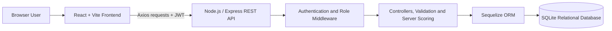

# DrillDeck System Architecture

## Data flow

1. A user registers or signs in through React.
2. Express validates the account and returns a signed JWT.
3. React stores the local session and sends the JWT with protected requests.
4. Middleware reloads the user and checks the current role before a controller runs.
5. Sequelize translates model operations into SQL queries.
6. A trainee receives scenario text and option IDs, but not hidden scores or feedback.
7. The feedback endpoint verifies that a selected option belongs to the correct step and published scenario.
8. On completion, the trainee submits choice IDs rather than a browser-calculated score.
9. The backend rejects duplicated/missing steps, revalidates every choice, calculates score, level and XP, then saves everything transactionally.
10. Attempt and AttemptAnswer rows store question, selected answer, feedback and scenario-detail snapshots.
11. History remains accurate after logout, restart, unpublishing or later scenario editing.
12. Dashboard controllers aggregate SQL attempts into trainee progress and administrator analytics.
13. Administrator routes provide full scenario editing, publication control, trainee account controls and detailed saved-answer review.

## Security and integrity boundaries

- Passwords are hashed with bcrypt.
- Protected routes require JWT authentication.
- Administrator and trainee permissions are enforced by backend middleware.
- Hidden scores are not sent in trainee scenario responses.
- Immediate feedback and final scoring are performed by the server.
- Transactions prevent partially saved scenarios, attempts or account deletion.
- Scenario deletion is blocked when historical attempts exist.
- Content rebuilding detaches old nullable references while preserving answer snapshots.
- Seed data runs only on an empty scenario table, so administrator changes persist.
- Health checks run a real SQL query.
- Basic anti-sniffing, frame and referrer response headers are set.
